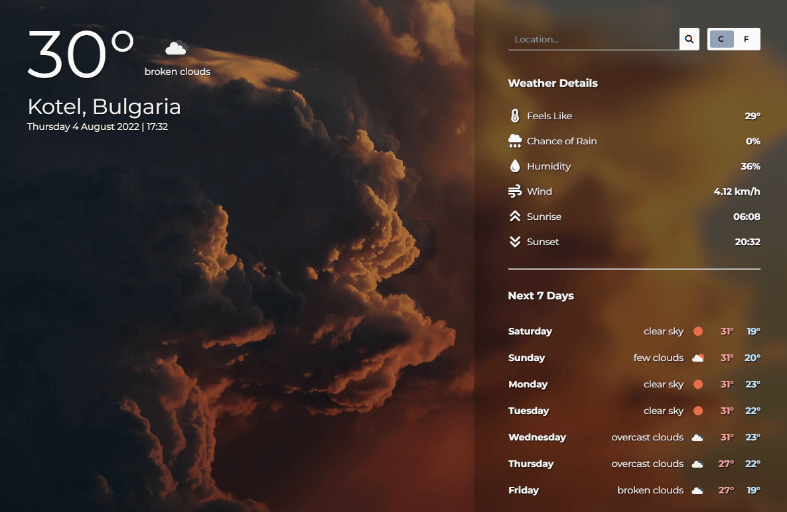

## Project: [Weather](https://weather-gdimitroff.netlify.app/)

Weather application used to show forecast from OpenWeather API. Built with **vanilla JavaScript**. The project is from The Odin Project [curriculum](https://www.theodinproject.com/lessons/node-path-javascript-weather-app).

### Getting Started

In order to setup and work on this project on your own, you will need to:

1. Clone this project:

   ```sh
    git clone https://github.com/GDimitroff/weather.git;
   ```

2. Once you have cloned this project, you can install the required dependencies by using:

   ```sh
   npm install
   ```

3. Generate an API key at [OpenWeather](https://openweathermap.org/).

4. Enter your generated API key in `/src/services/weatherService.js`:

   ```js
   const API_KEY = 'YOUR API KEY';
   ```

5. A live demo of the project can be started by using:

   ```sh
   npm start
   ```

6. Distribution files can be produced using:

   ```sh
   npm run build
   ```

### Features

- Get current and weekly forecast.
- Search cities worldwide.
- Switch between celsius or fahrenheit degrees.
- Fully responsive design.
- Unique weather symbols for each forecast description.
- Dynamic background based on the weather conditions of the searched location.

### Outcome

- Used revealing module pattern for code organizing.
- Used public API to get data.
- Used Webpack to build the app.
- Used third-party library for date and time formatting.
- Used HTML5 semantic elements for better structure and readability.
- Used CSS Grid and CSS Flexbox modules to create a responsive layout.
- Cross tested on Firefox and Chromium browsers.
- Learned to use basic API functionality.
- Learned basic error handling.
- Tried to maintain clean code.


